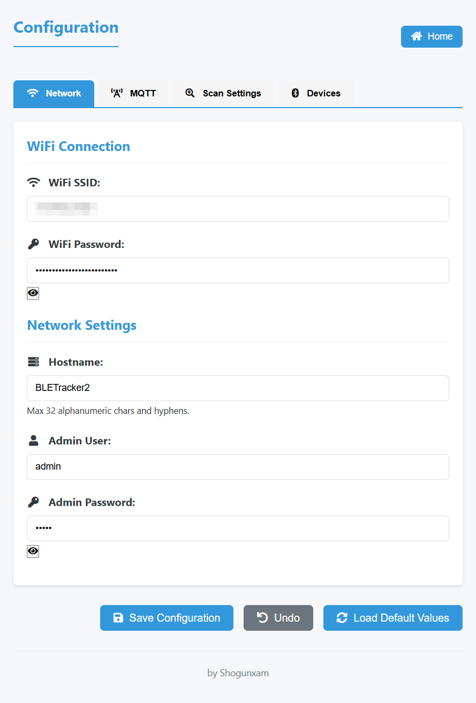

{:refdef: style="text-align: center;"}

{: refdef}

<h2>Contents</h2>
* TOC
{:toc}
## ESP32 BLETracker
This firmware help you to track a Bluetooth Low Energy device with an ESP32, using the MQTT protocol and [Home Assistant](https://www.home-assistant.io/) or [FHEM](https://fhem.de/) and the collectord daemon.<br>
Please note that the targeted device can't have a changing BLE address (normally called 'random' instead of 'public' address).<br><br>
**What this firmware can do for you:**  
* Tracks all discovered ble devices or only the desired devices placed in a white-list
* Selectively reads the battery level of tracked devices
* Generates MQTT topic for an easy integration in you favorite Home Automation Hub
* Mimics a lepresenced server to be integrated in FHEM
* You can configure the devices to be tracked directly from the integrated WebServer without need to re-flash the firmware
* Supports for OTA Update
* Logs main events in order to identify problems.


### Easy to build
Use [PlatformIO](https://platformio.org/) to build and deploy this firmware, remember to install [git](https://git-scm.com/downloads) in order to allow PlatformIO to download automatically all the required dependencies.<br>
You have to modify the **user_config.h** file inserting the correct information to connect to the WiFi and to the MQTT broker.<br>
The GATEWAY_NAME is used as Client ID to connect to the broker so be sure it's unique.<br>
The battery level can be read from the devices providing the Battery Service (0x180F) and the Battery Level characteristic (0x2A19), check the availability using a nRF Sniffer i.e. [nRF Connect](https://play.google.com/store/apps/details?id=no.nordicsemi.android.mcp)<br>
This feature was successfully tested with a Nut Mini, using other devices you could have connection problems.<br>
If many devices are discovered the battery level check can be very slow causing frequent Wi-Fi disconnection so that I have introduced a whitelist containing the Mac Address of the devices to check. The whitelist is in the form:<br>
BLE_BATTERY_WHITELIST       "XXXXXXXXX","YYYYYYYY"<br>
Mac Addresses have to be uppercase without ":" or "-" i.e "BA683F7EC159"

### MQTT Integration

The system publishes to the following topics:

1. **Availability Topic**:
   ```
   <LOCATION>/<GATEWAY_NAME>/LWT
   ```
   Payload: `online` or `offline`

   The default location is `home`

2. **Device State** (two format options):
   - **JSON Format** (default):
     ```
     <LOCATION>/<GATEWAY_NAME>/<BLE_ADDRESS>
     ```
     Payload: `{"state":"on|off","rssi":-XX,"battery":YY}`

   - **Separated Topics**:
     ```
     <LOCATION>/<GATEWAY_NAME>/<BLE_ADDRESS>/state
     <LOCATION>/<GATEWAY_NAME>/<BLE_ADDRESS>/rssi
     <LOCATION>/<GATEWAY_NAME>/<BLE_ADDRESS>/battery
     ```

3. **System Information**:
   ```
   <LOCATION>/<GATEWAY_NAME>/sysinfo
   ```
   Payload: `{"uptime":"...","version":"...","SSID":"...","IP":"..."}`

### Home Assistant Integration

Since version 3.8, the application supports automatic device discovery in Home Assistant.

### UDP Protocol Support

As an alternative to MQTT, the BLETracker can send UDP packets to a server.
UDP server and port can be configured in the `user_config.h` file or in the web interface.

- **Device status message**:  
  The UDP packet contains the device status and RSSI value. The message format is:
  ```
  module:<location>.<gateway_name> <BLE_ADDRESS>:<state> rssi:<rssi> timestamp:<timestamp>
  i.e.
  module=home.roomA 00:11:22:33:44:55=1 rssi=-65 timestamp=1718000000
  ```
- **System information message**:  
  The UDP packet contains the system information. The message format is:
  ```
  module:<location>.<gateway_name> uptime:<uptime> SSID:<wifi_ssid> rssi:<wifi_rssi> IP:<bletracker_ip> MAC:<bletracker_macaddress> timestamp:<timestamp>
  i.e.
  module=home.roomA uptime=1.00:00 SSID=mywifi rssi=-65 IP=192.168.1.100 MAC=00:11:22:33:44:55 timestamp=1718000000
  ```

### FHEM Support

As an alternative to MQTT, the BLETracker can integrate with FHEM:
- Acts as a lepresenced daemon
- Listens on port 5333 for collectord connections
- Enable by choosing the **esp32dev-ble-fhem-release** build variant in PlatformIO
- Note: FHEM and MQTT support are mutually exclusive due to memory constraints

**Configuration Note**: The values of `presence_timeout` and `absence_timeout` in collectord.conf must be greater than the BLE_SCANNING_PERIOD (default: 10 seconds).

### WEB Server
A WEB server is integrated into the BLETracker, it can be accessed using a web browser and the ip or the network name of the tracker.<br>
The WEB server can be used to see some system information and to update the firmware using an **OTA Update**, simply choosing the .bin file to upload.<br>
Default credential to access the WEB Server are:<br>
user: admin<br>
password: admin<br>
<br>
The new WEB server interface allow to customize the list of devices to be tracked, the scan period, and the MQTT broker parameters.<br>
The new interface allows also to monitor some logs. The number of logs is limited and when the maximum capacity is reached the oldest are removed.<br>
<br>
{:refdef: style="text-align: center;"}





{: refdef}

### Licence

Permission is hereby granted, free of charge, to any person obtaining a copy<br>
of this software and associated documentation files (the "Software"), to deal<br>
in the Software without restriction, including without limitation the rights<br>
to use, copy, modify, merge, publish, distribute, sublicense, and/or sell<br>
copies of the Software, and to permit persons to whom the Software is<br>
furnished to do so, subject to the following conditions:<br>
<br>
The above copyright notice and this permission notice shall be included in all<br>
copies or substantial portions of the Software.<br>
<br>
THE SOFTWARE IS PROVIDED "AS IS", WITHOUT WARRANTY OF ANY KIND, EXPRESS OR<br>
IMPLIED, INCLUDING BUT NOT LIMITED TO THE WARRANTIES OF MERCHANTABILITY,<br>
FITNESS FOR A PARTICULAR PURPOSE AND NONINFRINGEMENT. IN NO EVENT SHALL THE<br>
AUTHORS OR COPYRIGHT HOLDERS BE LIABLE FOR ANY CLAIM, DAMAGES OR OTHER<br>
LIABILITY, WHETHER IN AN ACTION OF CONTRACT, TORT OR OTHERWISE, ARISING FROM,<br>
OUT OF OR IN CONNECTION WITH THE SOFTWARE OR THE USE OR OTHER DEALINGS IN THE<br>
SOFTWARE.<br>

*If you like the content of this repo, please add a star! Thank you!*

## Support my work
If you like my work, please consider supporting me:

- [Buy me a coffee](https://www.buymeacoffee.com/shogunxam)
- [PayPal](https://paypal.me/shogunxam)

[buymeacoffee-shield]: https://www.buymeacoffee.com/assets/img/guidelines/download-assets-sm-2.svg
[buymeacoffee]: https://www.buymeacoffee.com/shogunxam
