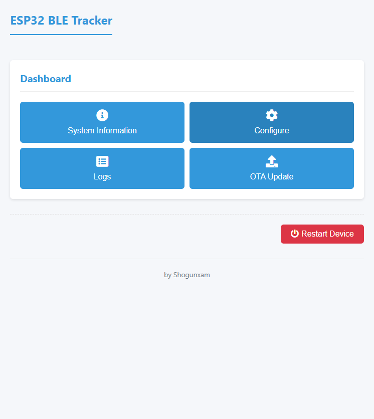
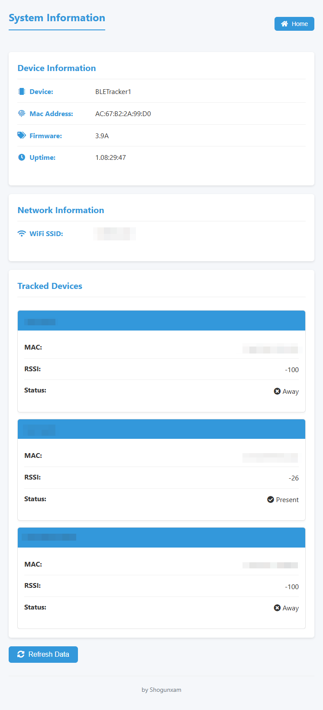
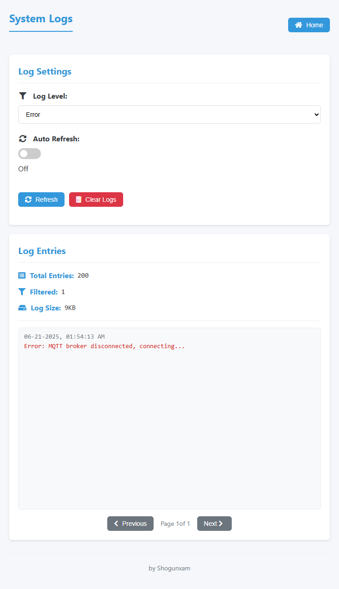

{:refdef: style="text-align: center;"}

{: refdef}

<h1>Contents</h1>
* TOC
{:toc}
# ESP32 BLETracker
This firmware help you to track a Bluetooth Low Energy device with an ESP32, uning the MQTT protocol and [Home Assistant](https://www.home-assistant.io/) or [FHEM](https://fhem.de/) and the collectord daemon. 
Please note that the targeted device can't have a changing BLE address (normally called 'random' instead of 'public' address). 

## Easy to build
Use [PlatformIO](https://platformio.org/) to build and deploy this application, remember to install [git](https://git-scm.com/downloads) in order to allow PlatformIO to download automatically all the required dependencies. 
You have to modify the **user_config.h** file inserting the correct informations to connect to the WiFi and to the MQTT broker. 
The GATEWAY_NAME is used as Client ID to connect to the broker so be sure it's unique. 
The battery level can be read from the devices providing the Battery Service (0x180F) and the Battery Level characteristic (0x2A19), check the avaiability using a nRF Sniffer i.e. [nRF Connect](https://play.google.com/store/apps/details?id=no.nordicsemi.android.mcp) 
This feature was succesfully tested with a Nut Mini, using other devices you could have connection problems. 
If many devices are discovered the battery level check can be very slow causing frequent Wi-Fi disconnection so that I have introduced a whitelist containing the Mac Address of the devices to check. The whitelist is in the form: 
BLE_BATTERY_WHITELIST       "XXXXXXXXX","YYYYYYYY" 
Mac Addresses have to be uppercase without ":" or "-" i.e "BA683F7EC159"

## MQTT integration
The firmware can generate the following topics: 
A topic for the BLETracker state: 
&lt;LOCATION&gt;/&lt;GATEWAY_NAME&gt;/&lt;BLE_ADDRESS&gt;/LWT payload: &lt;online|offline&gt;  
A single topic with the palyload in JSON format containing all the items retruned by the device (this is the default): 
&lt;LOCATION&gt;/&lt;GATEWAY_NAME&gt;/&lt;BLE_ADDRESS payload: { "state":&lt;"on"|"off"&gt;,"rssi":&lt;dBvalue&gt;,"battery":&lt;batterylevel&gt;}  
A topic for each item returned by the advertised device: 
&lt;LOCATION&gt;/&lt;GATEWAY_NAME&gt;/&lt;BLE_ADDRESS&gt;/state payload: &lt;"on"|"off"&gt; 
&lt;LOCATION&gt;/&lt;GATEWAY_NAME&gt;/&lt;BLE_ADDRESS&gt;/rssi payload: &lt;dBvalue&gt; 
&lt;LOCATION&gt;/&lt;GATEWAY_NAME&gt;/&lt;BLE_ADDRESS&gt;/battery payload: &lt;batterylevel&gt;  
A topic with helpfull system information: 
&lt;LOCATION&gt;/&lt;GATEWAY_NAME&gt;/&lt;BLE_ADDRESS&gt;/sysinfo, payload: { "uptime":&lt;timesinceboot&gt;,"version":&lt;versionnumber&gt;,"SSID":&lt;WiFiSSID&gt;,"IP":&lt;ipnumber&gt;}

## WEB Server
A WEB server is integrated into the BLETracker, it can be accessed using a web browser and the ip or the network name of the traker. 
The WEB server can be used to see some system informations and to update the firmware using an **OTA Update**, simply choosing the .bin file to upload. 
Default credential to access the WEB Server are: 
user: admin 
password: admin 
 
The new WEB server interface allow to customize the list of devices to be tracked, the scan period, and the MQTT broker paramters. 
The new interface allows also to monitor some logs. The number of logs is limited and when the maxium capacity is reached the oldest are removed. 
 
{:refdef: style="text-align: center;"}

{: refdef}

## FHEM Support
If properly configured the BLETracker can be integrate in your FHEM environment. Instead publishing MQTT tokens the BLETracker can be configured to act as a lepresenced daemon.
A server will run on the port 5333 listening for incoming connection generated by the collectord. The FHEM support and the MQTT support are mutually exclusive because of memory issues. The FHEM support can be easly enabled using Platform.io simply choosing the **esp32dev-ble-fhem-release** build variant. 
The values of *presence_timeout* and *absence_timeout* stored in the collectord.conf cannot be less than or equal to the BLE_SCANNING_PERIOD (default is 10 seconds).

## Build with Arduino IDE
You can build this skatch using Arduino IDE (currently it's using arduino-esp32 v1.0.4), but be sure to install the required dependencies: 
* You have to install the esp32 Board in Arduino IDE. You can find a tutorial following this [link]( https://randomnerdtutorials.com/installing-the-esp32-board-in-arduino-ide-windows-instructions/)
* You have to install the library PubSubClient v2.8 (not needed if you want enable FHEM support)
* To enable the FHEM support you have to:
    * install the Regexp library (https://www.arduino.cc/reference/en/libraries/regexp/)
    * set USE_MQTT to false and USE_FHEM_LEPRESENCE_SERVER to true in the config.h
* Because a bug in the BLE library provided by arduino-esp32 v1.0.4 you have to replace it with this one https://github.com/shogunxam/ESP32-BLE-Arduino. 
 **Since the release v2.1 this one must be used https://github.com/espressif/arduino-esp32/tree/6b0114366baf986c155e8173ab7c22bc0c5fcedc/libraries/BLE.** 
 The libray to replace should be located in the folder ~/.arduino15/packages/esp32/hardware/esp32/x.x.x/libraries/BLE for Unix users and in C:\Users\YourUserName\AppData\Local\Arduino15\packages\esp32\hardware\esp32\x.x.x\libraries\BLE for Windows users. 

Build using the *Minimal SPIFFS* partition schema.

## Licence

Permission is hereby granted, free of charge, to any person obtaining a copy 
of this software and associated documentation files (the "Software"), to deal 
in the Software without restriction, including without limitation the rights 
to use, copy, modify, merge, publish, distribute, sublicense, and/or sell 
copies of the Software, and to permit persons to whom the Software is 
furnished to do so, subject to the following conditions: 
 
The above copyright notice and this permission notice shall be included in all 
copies or substantial portions of the Software. 
 
THE SOFTWARE IS PROVIDED "AS IS", WITHOUT WARRANTY OF ANY KIND, EXPRESS OR 
IMPLIED, INCLUDING BUT NOT LIMITED TO THE WARRANTIES OF MERCHANTABILITY, 
FITNESS FOR A PARTICULAR PURPOSE AND NONINFRINGEMENT. IN NO EVENT SHALL THE 
AUTHORS OR COPYRIGHT HOLDERS BE LIABLE FOR ANY CLAIM, DAMAGES OR OTHER 
LIABILITY, WHETHER IN AN ACTION OF CONTRACT, TORT OR OTHERWISE, ARISING FROM, 
OUT OF OR IN CONNECTION WITH THE SOFTWARE OR THE USE OR OTHER DEALINGS IN THE 
SOFTWARE. 

*If you like the content of this repo, please add a star! Thank you!*

# Support my work
If you like my work, please consider buying me a coffee. Thank you for your support! :grin:  
[![Buy me a coffee][buymeacoffee-shield]][buymeacoffee]

[buymeacoffee-shield]: https://www.buymeacoffee.com/assets/img/guidelines/download-assets-sm-2.svg
[buymeacoffee]: https://www.buymeacoffee.com/shogunxam
